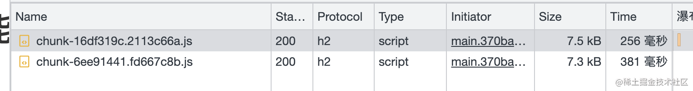
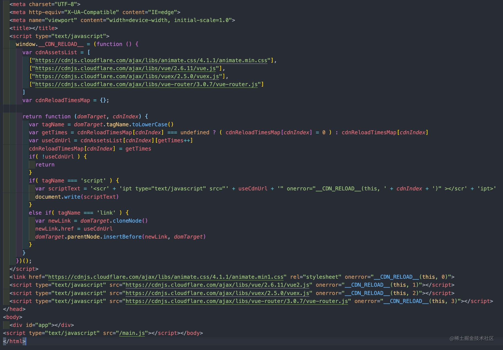
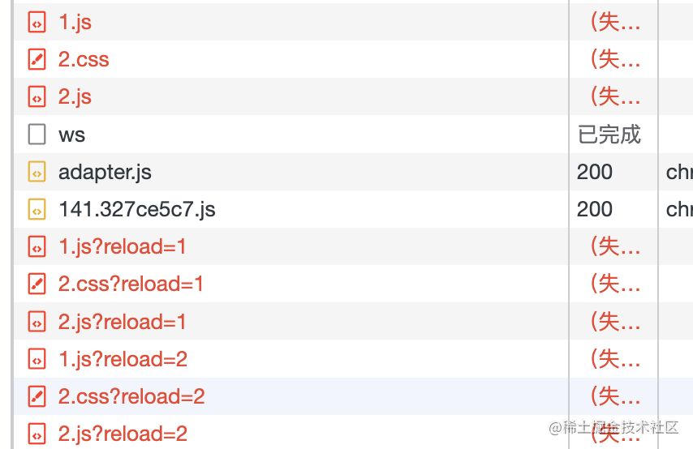

# assets-reload-webpack-plugin
Front-end resource disaster recovery solutions


Development ideas can be found in [this article]();


Currently only webpack > 4 is supported, if you need more versions please raise issues to me, I will deal with it as soon as possible.

# Install

```shell
npm i assets-reload-webpack-plugin -D
```


# Usage

## example

demo：

```javascript
// webpack.config.js
const { AssetsReloadWebpackPlugin } = require('assets-reload-webpack-plugin')

module.exports = {
  // ....
  plugins: [
    new AssetsReloadWebpackPlugin({
      // inlineAssets
      inlineAssets: [
        ['https://cdnjs.cloudflare.com/ajax/libs/animate.css/4.1.1/animate.min1.css', 'https://cdnjs.cloudflare.com/ajax/libs/animate.css/4.1.1/animate.min.css'],
        ['https://cdnjs.cloudflare.com/ajax/libs/vue/2.6.11/vue2.js', 'https://cdnjs.cloudflare.com/ajax/libs/vue/2.6.11/vue.js'],
        ['https://cdnjs.cloudflare.com/ajax/libs/vuex/2.5.0/vuex.js', "https://cdnjs.cloudflare.com/ajax/libs/vuex/2.5.0/vuex.js"],
        ['https://cdnjs.cloudflare.com/ajax/libs/vue-router/3.0.7/vue-router.js', "https://cdnjs.cloudflare.com/ajax/libs/vue-router/3.0.7/vue-router.js"]
      ],

      // dynamicAssets
      dynamicAssets: {
        animate: ['https://cdnjs.cloudflare.com/ajax/libs/animate.css/4.1.1/animate.min222.css', 'https://cdnjs.cloudflare.com/ajax/libs/animate.css/4.1.1/animate.min.css'],
        vue: ['https://cdnjs.cloudflare.com/ajax/libs/vue/2.6.11/vue2.js', 'https://cdnjs.cloudflare.com/ajax/libs/vue/2.6.11/vue.js'],
        vuex: ['https://cdnjs.cloudflare.com/ajax/libs/vuex/2.5.0/vuex.js', "https://cdnjs.cloudflare.com/ajax/libs/vuex/2.5.0/vuex.js"],
        vueRouter: ['https://cdnjs.cloudflare.com/ajax/libs/vue-router/3.0.7/vue-router.js', "https://cdnjs.cloudflare.com/ajax/libs/vue-router/3.0.7/vue-router.js"]
      },

      // chunkAssets
      chunkAssetsPublicpath: [
        'https://www.backupPublic01.com/', 
        'https://www.backupPublic02.com/', 
        'https://www.backupPublic03.com/'
      ],

      maxChunkAssetsRetries: 4,
      chunkAssetsRetryDelay: function(times) {
        return times * 1000
      }

    })
  ]
}
```


## Distinguish between types of assets

### inlineAssets
Synchronized resources inside HTML documents


such as：

```html
<head>
  <!-- ... -->
  <link href="./test.css" rel="stylesheet" >
  <script type="text/javascript" src="./jquery.js" ></script>
<head>
```


### chunkAssets


Asynchronously loaded js chunks are usually introduced in webpack using the following


```js
import('lodash').then(_ => {
  // ...
})
```





### dynamicAssets
External assets that need to be loaded manually for certain situations within the project


Because chunk assets have a problem, that is, there is no good way to unload the assets that have been loaded. When chunk a is loaded, and then loaded chunk b, the js and css of chunk a are still in effect in the dom and will not be deleted. What is the problem with this?

For example, in a project with two routes `/a/b` and `/a/c`, for some reason `/a/b` needs `antd.css`, but `/a/c` can't use `antd.css` for historical reasons, and introducing `antd.css` its global style will break the original `/a/c` and cause the layout to collapse. Even if you only introduce `antd.css` in `/a/b`, as long as the user's access path is `/a/b` -> `/a/c`, the layout will be broken.


## Options 

<!-- inject = 'head', 
    inlineCore = true,  -->

### inlineAssets
#### options.inlineAssets
  `Type`:  two-dimensional array

  `Default`: No default value


  `Description`: 

  The addresses associated with the same assets are placed in the same array, which can be of any length, and the actual requests are tried in the order in which they are filled in, for example, `asstes A`, which will first try index 0, return successfully if 0 succeeds, try index 1 if 0 fails, and so on, until there are no more addresses to try.

  The assets are inserted into the HTML document in the one-dimensional order of the array.


  ```js
  {
    inlineAssets: [
      [ 'assets A backup address 01', 'assets A backup address 02',  'assets A address 03'],
      [ 'assets B backup address 01', 'assets B backup address 02'],
      [ 'assets C backup address 01'],
    ]
  }
  ```
  
  
  `Results Preview`:


  


#### options.inlineAssetsGlobalVariable

`Type`: string

`Default`: `__CDN_RELOAD__`

`Description`: 

  The exception handling functions for script and link tags need to be attached to the window, and this parameter can modify the variable name used to attach to the window
  


### chunkAssets


#### options.chunkAssetsPublicpath

`Type`:  array

`Default`: []


`Description`: 

The retry strategy for chunk assets is slightly different, we will first access your `output.publicPath` in webpack and return it if it succeeds, if it fails we will switch `publicPath` to the address configured by the plugin's `chunkAssetsPublicpath` parameter and try it one by one. If the maximum number of retries is greater than the combined length of `output.publicPath` + `chunkAssetsPublicpath`, all requests exceeding that length will use the address at the end of `chunkAssetsPublicpath`.


#### options.chunkAssetsReloadQueryValue

`Type`:  function

`Default`: 
```js
function (url, times) {
  if( times === 0 ) {
    return url
  }
  if( url.indexOf('?') === -1 ) {
    return url + '?reload=' + times
  }else {
    return url + '&reload=' + times
  }
}
```

`Description`: 

Control the query parameters for retry requests




#### options.maxChunkAssetsRetries

`Type`: number

`Default`: 3

`Description`: Maximum number of load retries


#### options.chunkAssetsRetryDelay
`Type`: function | number

`Default`: 3000

`Description`: The time interval between error retries. The function type accepts a parameter times, indicating the number of retries.


### dynamicAssets
#### options.dynamicAssets


`Type`: object

`Default`: No default value

`Description`: 
  
`useage`:

```js
{
  dynamicAssets: {
    // [cdnName]: [backupAddress, backupAddress, ...]
    vue: [
      'https://cdnjs.cloudflare.com/ajax/libs/vue/2.6.11/vue2.js', 
      'https://cdnjs.cloudflare.com/ajax/libs/vue/2.6.11/vue.js'
    ]
  },
}
```


How to use the loader
```js
window.$cdn.mount('vue', () => {
  console.log('success')
}, (error) => {
  console.log('error')
})

window.$cdn.mount(
  // cdnName
  'vue', 
  // tag custom Option
  {  crossorigin: 'anonymous' },
  //  callback
  () => {
    console.log('success')
  }, 
  (error) => {
    console.log('error')
  }
)

// destroy
window.$cdn.destroy('vue', () => {
  console.log('success')
}, (error) => {
  console.log('error')
})
```


#### options.dynamicAssetsGlobalVariable

`Type`: string

`Default`: `$cdn`

`Description`: 

  The plugin needs to hook the specific logic for loading assets to a variable in window, and this parameter controls the name of that variable.


### options.inlineCore
`Type`: boolean

`Default`: true

`Description`
Is it inline to the HTML document? False generates a separate JS file


### options.inject

`Type`: head | body

`Default`: head

`Description`: At which tag is core code inserted when inlineCore is true